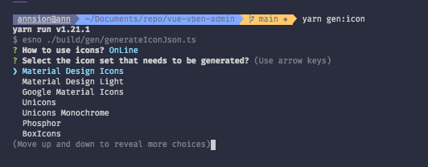

# 图标

项目中有两种图标使用方式。

1. 使用`ant-design-vue`提供的图标

```vue
<template>
  <StarOutlined />
  <StarFilled />
  <StarTwoTone twoToneColor="#eb2f96" />
</template>

<script>
  import { defineComponent } from 'vue';
  import { StarOutlined, StarFilled, StarTwoTone } from '@ant-design/icons-vue';
  export default defineComponent({
    components: { StarOutlined, StarFilled, StarTwoTone },
  });
</script>
```

2. 使用`Iconify`（推荐）

使用方式请参考 [Icon 组件](../../comp/glob/icon.md)

## 如何在 vite 内引入 iconify 组件

项目中使用到的是[vite-plugin-purge-icons](https://github.com/antfu/purge-icons/blob/main/packages/vite-plugin-purge-icons/README.md)这个插件来进行图标实现。

1. 安装依赖

```bash

yarn add @iconify/iconify

yarn add @iconify/json @purge-icons/generated -D

```

2. 在 `vite.config.ts`内引入插件

```ts
import PurgeIcons from 'vite-plugin-purge-icons';

export default {
  plugins: [PurgeIcons()],
};
```

3. 编写 Icon 组件

完整代码 [/@/components/Icon/index.tsx](https://github.com/anncwb/vue-vben-admin/tree/main/src/components/Icon/index.tsx)

```tsx
export default defineComponent({
  name: 'Icon',
  props: {
    // icon name
    icon: {
      type: String as PropType<string>,
      required: true,
    },
    // icon color
    color: {
      type: String as PropType<string>,
    },
    // icon size
    size: {
      type: [String, Number] as PropType<string | number>,
      default: 14,
    },
    prefix: {
      type: String as PropType<string>,
      default: '',
    },
  },
  setup(props, { attrs }) {
    const elRef = ref<Nullable<HTMLElement>>(null);

    const getIconRef = computed(() => {
      const { icon, prefix } = props;
      return `${prefix ? prefix + ':' : ''}${icon}`;
    });
    const update = async () => {
      const el = unref(elRef);
      if (el) {
        await nextTick();
        const icon = unref(getIconRef);

        const svg = Iconify.renderSVG(icon, {});

        if (svg) {
          el.textContent = '';
          el.appendChild(svg);
        } else {
          const span = document.createElement('span');
          span.className = 'iconify';
          span.dataset.icon = icon;
          el.textContent = '';
          el.appendChild(span);
        }
      }
    };

    watch(() => props.icon, update, { flush: 'post' });

    const wrapStyleRef = computed((): any => {
      const { size, color } = props;
      let fs = size;
      if (isString(size)) {
        fs = parseInt(size, 10);
      }
      return {
        fontSize: `${fs}px`,
        color,
        display: 'inline-flex',
      };
    });

    onMounted(update);

    return () => (
      <div ref={elRef} class={[attrs.class, 'app-iconify']} style={unref(wrapStyleRef)} />
    );
  },
});
```

## 使用组件

使用方式请参考 [Icon 组件](../../comp/glob/icon.md)

## 图标集预生成

由于图标选择器这个比较特殊的存在,项目会打包一些比较多的图标。图标选择器的图标需要事先指定并生成相应的文件

### 生成图标集

- 执行图标生成命令

```bash
yarn gen:icon
```

- 这里会让你选择 本地还是在线生成,两种方式各有利弊，下面会说如图所示,

local 表示本地 online 表示在线,回车确认


- 选择你要生成的图标集,回车确认



- 选择图标输出的目录(项目默认 src/components/Icon/data)，可以直接回车选择默认


到这里图标集已经生成完成了，此时你的图标选择器已经是你所选的的图标集的图标了。

**注意不要频繁更新**

::: warning 注意

如果前面选择的是本地生成的话，频繁更换图标集，可能会导致图标丢失或者显示不出来

:::

## 本地图标集和在线图标集优缺点

### 在线(项目默认,推荐)

该方式会在图标选择器使用到图标的时候进行在线请求,然后缓存对应的图标到浏览器。可以有效减少代码打包体积。

如果你的项目可以访问外网，建议可以使用这种方式

**缺点：** 在局域网或者无法访问到外网的环境中图标显示不出来

### 本地

该方式会在打包的时候将图标选择器的图标全部打包到 js 内。在使用的时候不会额外的请求在线图标

**缺点：** 打包体积会偏大，具体的体积增加得看前面选择图标集的时候选择的图标数量的多少决定
